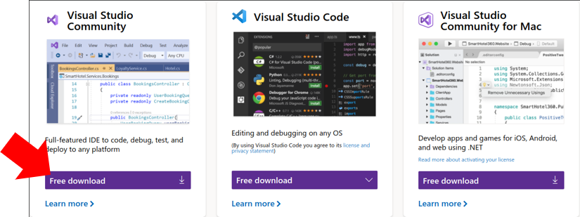
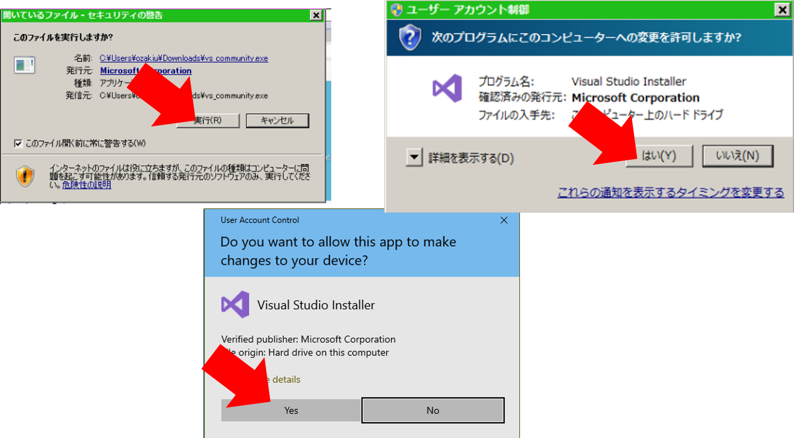

# Visual Studio のインストール方法

## Visual Studio Installer のダウンロード/実行

* 下記のURLへアクセス
https://visualstudio.microsoft.com/free-developer-offers/

* 一番左の “Visual Studio Community” の “Download” をクリックする。

* ダウンロードしたファイルの実行
    * Edge の場合
    “Download” をクリック後、下記のようなメッセージがでるので、”Run” をクリック
    
    * Chrome の場合
    “Download” をクリック後、Window 下部に表示されるファイル名をクリック
    

* 実行後にメッセージがでる場合
ファイルの実行を確認するメッセージがでる場合は、”Yes”、”はい”、”実行”などをクリックしてください。

### 別のダウンロード方法 (非推奨)

* インターネット接続がない場合など、USB ドライブなどで、[ファイル]() を入手。
* このファイルを実行し解凍。
* 解凍されたディレクトリ内の `vs_community.exe` を実行する。インストール方法は下記の通り。

## Visual Studio のインストール方法

* Installer 起動後、”続行” を選択します。

* 下記のようなメッセージがでるのでしばらく待ちます。

* C++ によるデスクトップ開発 (Desktop development with C++) にチェックを入れて、インストール。

* インストールにしばらく時間がかかります。(30分程度)

* インストール後、下記のようなメッセージが出る。意味がわからなければ、”Not now” -> “Start Visual Studio” をそのまま選択。

