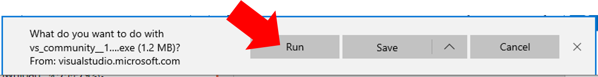
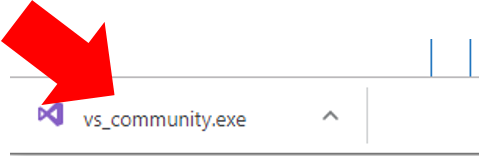
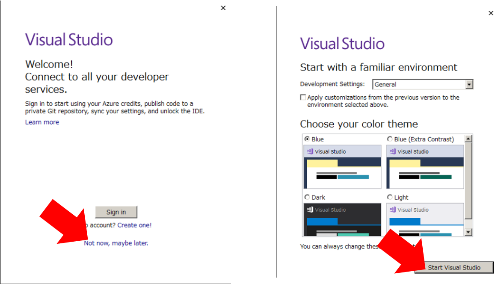

# Visual Studio のインストール方法

## 1. Visual Studio Installer のダウンロード/実行

* 1-1. [ダウンロードページ](https://visualstudio.microsoft.com/free-developer-offers/)へアクセス

* 1-2. 一番左の “Visual Studio Community” の “Download” をクリックする。

* 1-3. ダウンロードしたファイルの実行
    * Edge の場合
    “Download” をクリック後、”Run” をクリック
    
    * Chrome の場合
    “Download” をクリック後、Window 下部に表示されるファイル名をクリック
    

* 1-4. ファイルの実行を確認するメッセージがでる場合は、”Yes”、”はい”、”実行”などをクリックしてください。

## 2. Visual Studio のインストール方法

* 2-1. Installer 起動後、”続行” を選択します。

* 2-2. 下記のようなメッセージがでるのでしばらく待ちます。

* 2-3. C++ によるデスクトップ開発 (Desktop development with C++) にチェックを入れて、インストール。

* 2-4. インストールにしばらく時間がかかります。(30分程度)

* 2-5. インストール後、下記のようなメッセージが出る。意味がわからなければ、”Not now” -> “Start Visual Studio” をそのまま選択。

## Appendix. 別のダウンロード方法 (非推奨)

* インターネット接続がない場合など、USB ドライブなどで、[Offline Install 用ファイル](https://github.com/carele-imgrecog/carele-imgrecog.github.io/releases/download/v1.0.1/vs_cppdev.exe) を入手。
* このファイルを実行し解凍。
* 解凍されたディレクトリ内の `vs_community.exe` を実行する。インストール方法は同じ。
