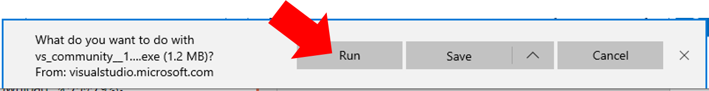
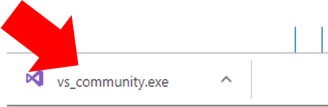
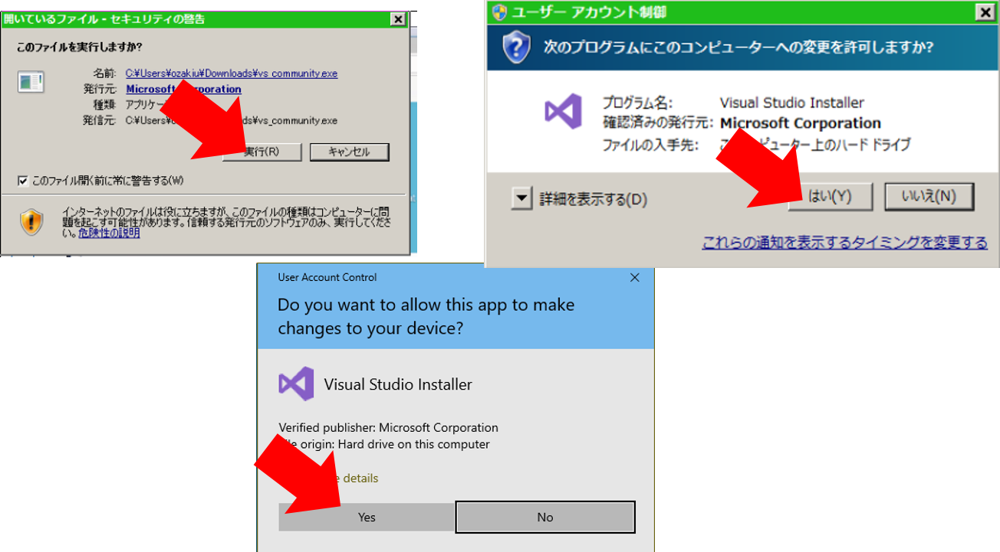
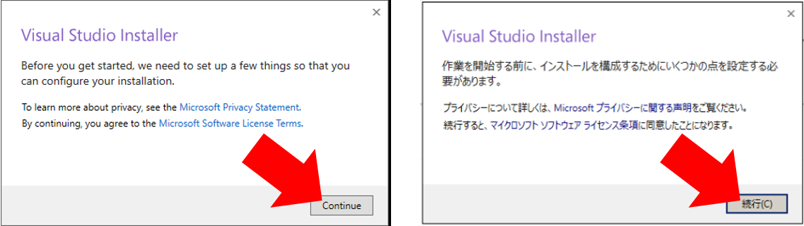
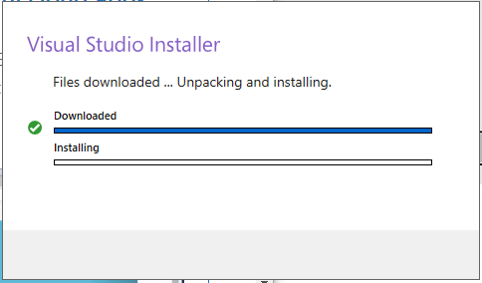
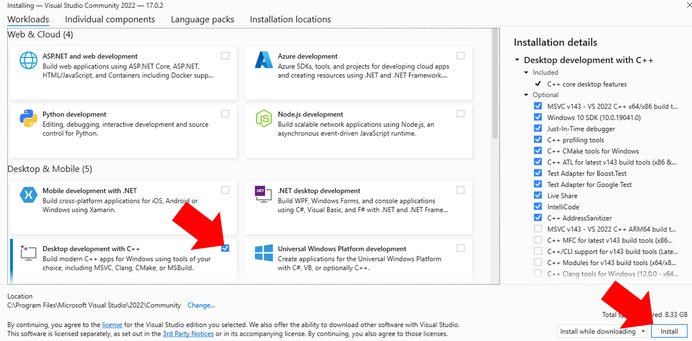
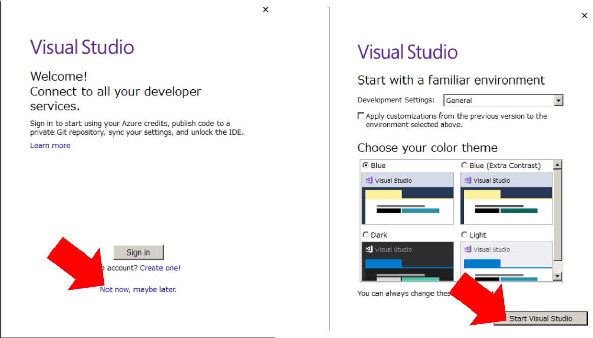

# Visual Studio のインストール方法

演習を実施するために、Visual Studio 2019 Community Edition (C++開発環境) のインストールが必要です。

Visual Studio の 他の Version の C++ 開発環境をインストール済みの場合は、それを使用可能ですので本作業は不要です。

* 例) 古いバージョンでの C++ 開発環境
    * Visual Studio 2010 以降であれば問題ありません。
    * (いずれも、Visual Studio の C++ 開発環境を選択してインストールしていること。)
* 例) 異なるエディションの C++ 開発環境
    * Express Edition, Professional Edition, Enterprise Edition
    * (いずれも、Visual Studio の C++ 開発環境を選択してインストールしていること。)

## 1. Visual Studio Installer のダウンロード/実行

* 1-1. [ダウンロードページ](https://visualstudio.microsoft.com/free-developer-offers/)へアクセス

* 1-2. 一番左の “Visual Studio Community” の “Download” をクリックする。

* 1-3. ダウンロードしたファイルの実行
    * Edge の場合
    “Download” をクリック後、”Run” をクリック
    
    * Chrome の場合
    “Download” をクリック後、Window 下部に表示されるファイル名をクリック
    

* 1-4. ファイルの実行を確認するメッセージがでる場合は、”Yes”、”はい”、”実行”などをクリックしてください。

## 2. Visual Studio のインストール方法

* 2-1. Installer 起動後、”続行” を選択します。

* 2-2. 下記のようなメッセージがでるのでしばらく待ちます。

* 2-3. C++ によるデスクトップ開発 (Desktop development with C++) にチェックを入れて、インストール。

* 2-4. インストールにしばらく時間がかかります。(30分程度)

* 2-5. インストール後、下記のようなメッセージが出る。意味がわからなければ、”Not now” -> “Start Visual Studio” をそのまま選択。

## (Appendix. ) Offline Installer の入手方法 (インターネット接続がない場合)

* インストールしたい PC にインターネット接続がない場合は、他の PC で [Offline Install 用ファイル](https://www.dropbox.com/s/gjis7eu1ekdgww0/vs_cppdev.zip?dl=1) をダウンロードする。
* USB ドライブなどを経由して、インストールしたいPCにこのファイルを移動し、解凍。
    * 右クリックで "すべて展開 (Extract All)"　を選択することで解凍できる。
* 解凍されたディレクトリ内の `vs_community.exe` を実行する。インストール方法は上記と同じ。
